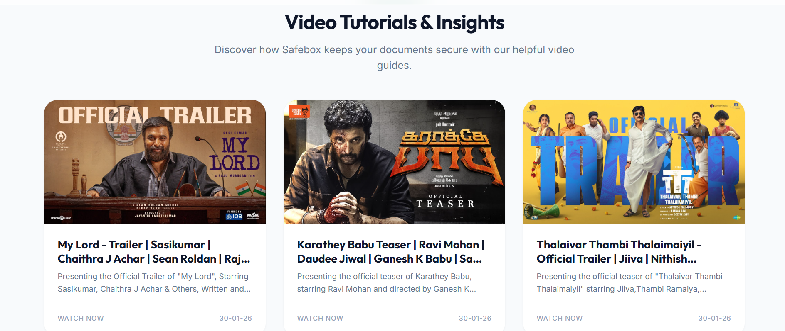
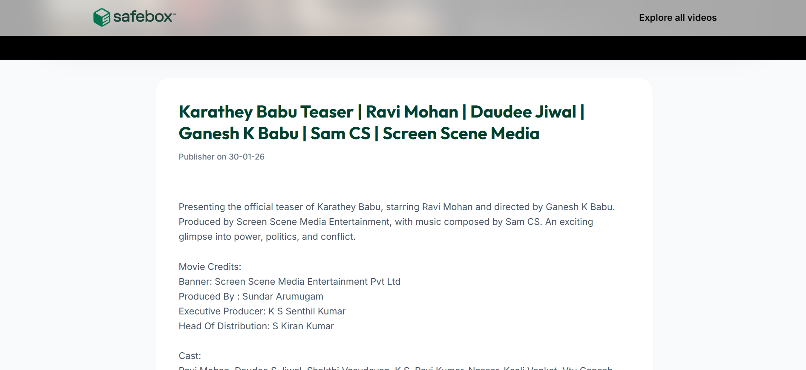
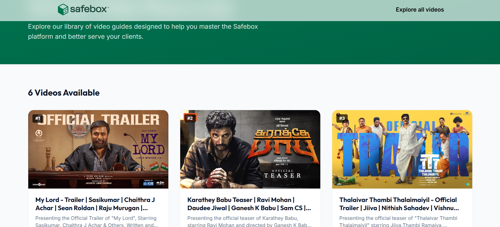
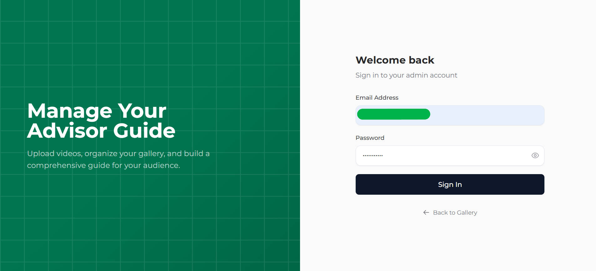
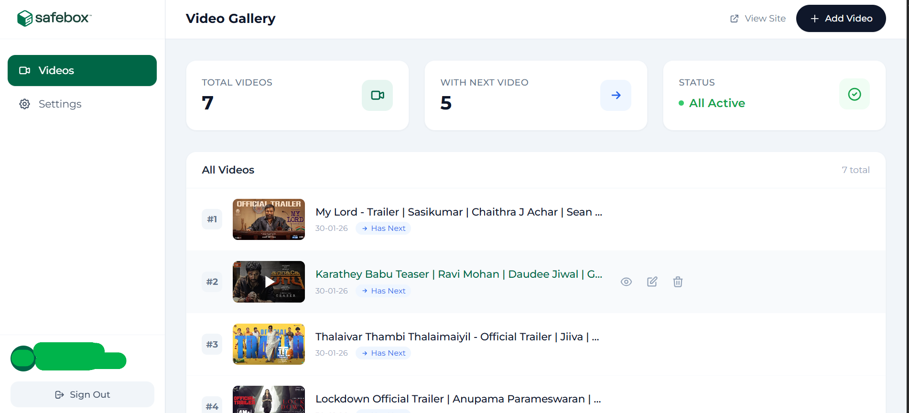
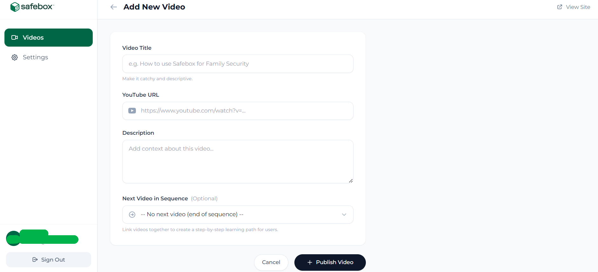

# Safebox Advisor Gallery

A comprehensive video gallery and learning platform designed for advisors, built with FastAPI.

## Features

- **Advisor Video Portal**: A dedicated interface for advisors to access video tutorials and insights in a sequential learning path.
- **Admin Dashboard**: Secure backend for managing video content, ordering, and descriptions.
- **Sequential Learning**: Videos are organized in a specific order with "Up Next" suggestions to guide advisors through a structured curriculum.
- **YouTube Integration**: Easily embed and manage YouTube videos by simply pasting the URL.
- **Responsive Design**: Built with TailwindCSS for a seamless experience on all devices.

## Tech Stack

- **Backend**: FastAPI (Python)
- **Database**: SQLite (Async with `aiosqlite`)
- **Frontend**: Jinja2 Templates + TailwindCSS
- **Authentication**: Cookie-based authentication for admin access

## Installation

1. **Clone the repository**:

    ```bash
    git clone <repository_url>
    cd safebox-blog
    ```

2. **Create and activate a virtual environment**:

    ```bash
    python -m venv .venv
    # Windows
    .venv\Scripts\activate
    # macOS/Linux
    source .venv/bin/activate
    ```

3. **Install dependencies**:

    ```bash
    pip install -r app/requirements.txt
    ```

## Usage

1. **Run the server**:

    ```bash
    python app/main.py
    # or
    uvicorn app.main:app --host 0.0.0.0 --port 80 --reload
    ```

2. **Access the application**:
    - **Advisor Portal**: [http://localhost](http://localhost) (Public Gallery)
    - **Admin Dashboard**: [http://localhost/admin/login](http://localhost/admin/login)

## Default Admin Credentials

When the application starts for the first time, a default admin account is created:

- **Email**: `admin@safebox.life`
- **Password**: `Safebox@123`

> **Note**: You can change these credentials in the Admin Settings or via environment variables/config.

## Gallery









